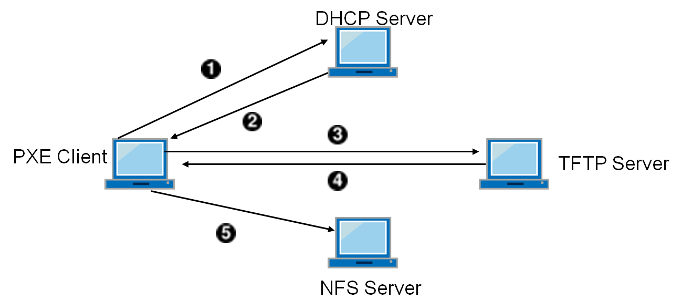

# Linux-109b
110710529 廖明志

## 目錄
---
* [PXE](#PXE)
* [DNS server](#DNS-server)
* [DNS server 反向解析](#DNS-server-反向解析)
* [DNS 主輔同步](#DNS-主輔同步)
* [智能DNS](#智能DNS)
* [Docker](#Docker)

### PXE ( Pre-boot Execution Environment )
---
* 協定 :
    1. DHCP - 用於尋找合適的啟動伺服器
    2. TFTP - 用於下載網路啟動程式（NBP）和附加檔案

* 運作流程圖 :\
    
    > source https://docs.freebsd.org/zh-tw/books/handbook/advanced-networking/#network-diskless

* 運作流程 : PXE是由Intel設計的協議，它可以使計算機通過網路而不是從本地硬碟、光碟機等裝置啟動。現代的網絡卡，一般都內嵌支援PXE的ROM晶片。當計算機引導時，BIOS把PXE client調入記憶體執行，並顯示出命令選單,經使用者選擇後，PXE client將放置在遠端的作業系統通過網路下載到本地執行。

* 實作 :
    1. `yum install tftp-server dhcp syslinux vsftpd`\
    安裝所需套件
    2. `vim /etc/dhcp/dhcpd.conf`\
    更改 *dhcp* 配置 :\
    
    > source 上課用資料
    3. `vim /usr/lib/systemd/system/tftp.service`\
    更改 *tftp* 配置 :\
    
    > source 上課用資料
    4. `mkdir /usr/lib/systemd/system/tftpboot`\
    在 *dhcp* 配置檔中 `filename "pxelinux.0";`，檔案目錄是相對於 *tftp* 的根目錄 ( 預設是 /tftpboot ) ，所以創建 *tftpboot* 資料夾。
    5. `cd /usr/share/syslinux`\
    `cp pxelinux.0 menu.c32 memdisk mboot.c32 chain.c32 /tftpboot/`\
    將必要的 *syslinux* 檔案，複製到 *tftpboot* 分享目錄內。
    6. 用 *winscp* 將映像檔複製到虛擬機。
    7. `mount CentOS-7-x86_64-DVD-2009.iso /mnt`\
    `cp -R /mnt/* /var/ftp/pub`\
    將映像檔，複製到 *vsftp* 分享目錄上。
    8. `cd /var/ftp/pub/images/pxeboot`\
    `cp vmlinuz initrd.img /tftpboot/netboot/`\
    將 Linux PXE 開機核心檔案，放置於 tftp Server ( aka *tftpboot*) 分享目錄上。
    9. 用 *winscp* 把 *Kstart* 檔案複製到虛擬機。
    10. `cp /home/user/ks.cfg /var/ftp/pub/ks.cfg`\
    將 *Kstart* 檔，複製到 *vsftp* 分享目錄上。
    11. `vim /var/ftp/pub/ks.cfg`\
    更改檔案內容。將url的部分改成 `"url=ftp://192.168.100.254/pub"`
    12. `chmod 644 /var/ftp/pub/ks.cfg`\
    更改 *Kstart* 檔案權限。
    13. `vim /tftpboot/pxelinux.cfg/default`\
    編寫 PXE Server 開機選單 :\
    
    > source 上課用資料
    14.`.cd /tftpboot/`\ 
    `chmod 755 netboot/，chmod 755 pxelinux.cfg/`\
    更改權限。
    15. `ls al`\
    確認權限。
    16. 啟動PXE虛擬機\
    
    > source 上課實作

### DNS server ( Domain Name System server )
---
* DNS : 為將域名和IP位址相互對映的一個分散式資料庫，能夠使人更方便地存取網際網路。

* 實作需求 : 虛擬機 A、B

* 管理網路實作 :
    1. `yum install bind-utils`\
    `yum install bind -y`\
    在虛擬機 A 安裝所需套件
    2. `gedit /etc/named.conf`\
    BIND的主配置文件
    
    > source 上課用資料
    3. `gedit /etc/named.rfc1912.zones`\
    新增一個網域 :
        ```
        zone "arthur.com" IN {
            type  master;
            file  "arthur.com.zone";
            allow-update { 192.168.56.108;192.168.56.110; };
        };
        ```
    4. `gedit /var/named/arthur.com.zone`\
    輸入 :
        ```
        $TTL 600

        @ IN SOA	@ adamnelson1234512345.gmail.com (
                    2021031801
                    10800
                    900
                    604800
                    86400
                    )
                NS      @
        	    A       192.168.56.108
        www     A       192.168.56.200
        ```
    5. `named-checkzone arthur.com /var/named/arthur.com.zone`\
    確認配置正確。
    6. `systemctl start named`\
    啟動server
    7. 到 虛擬機B 中，輸入 :\
    `host -t a www.arthur.com 192.168.56.108`\
    在 CMD 中，輸入 :\
    `nslookup www.arthur.com 192.168.56.108`\
    結果 :
    
    > source 上課實作

### DNS server 反向解析
---
* 實作需求 : 虛擬機 A、B

* 實作 :
    1. `gedit /etc/named.rfc1912.zones`\
    於 虛擬機A 中添加反解域的自定義區域配置 :
        ```
        zone "56.168.192.in-addr.arpa" IN {

            type master;

            file "56.168.192.in-addr.arpa.zone";

            allow-update { none; };

        };
        ```
    2. `gedit /var/named/56.168.192.in-addr.arpa.zone`\
    修改配置 :
        ```
        $TTL 600
        @ IN SOA        @ adamnelson1234512345.gmail.com (
                        2021031801
                        10800
                        900
                        604800
                        86400
                        )
        56.168.192.in-addr.arpa.    IN  NS  dns1.a.com.
        56.168.192.in-addr.arpa.    IN  NS  dns2.a.com.

        200.56.168.192.in-addr.arpa.    IN  PTR www.a.com.
        ```
    3. 使用指令 `named-checkconf` 確認配置文件沒有錯誤，然後 `systemctl restart named`
    4. 上為正解，下為反解 :
    
    > source 上課實作

### DNS 主輔同步
---
* 實作 :
    1. `yum install bind`\ 
    在 虛擬機B 上安裝 bind。
    2. 將 `dnssec-validation` 設為 `no`。
    3. power > setting > detail > date&time 將所有 *automatic* 選項打開。
    4. `gedit /etc/sysconfig/named`\
    增加 :
        ```
        ENABLE_ZONE_WRITE=yes
        OPTIONS="-4"
        ```
    5. `gedit /etc/named.rfc1912.zones`\
    增加 :
        ```
        zone "a.com" IN {
                type  slave;
                file  "slave/a.com.zone";
                masters { 192.168.56.108; };
        };
        ```
    6. 在 虛擬機A 中 :
    `gedit /etc/named.conf`\
    新增 :
        ```
        allow-transfer	{ 192.168.56.110; };
	    also-notify	    { 192.168.56.110; };
        ```
    7. 虛擬機A 如步驟 2。
    8. `gedit /etc/sysconfig/named`\
    增加 `OPTIONS="-4"`
    9. `gedit /var/named的a.com.zon`\
    調高 serial 值。
    10. 重啟 DNS server
    11. 結果 :
        
        > source 上課實作

### 智能DNS
---
* 概念 : 根據來源Ip，回答的結果不同。
* 實作 :
    1. 在 虛擬機A 中 :\
    `gedit /etc/var/named/env-test.a.com.zone`
        ```
        $TTL 600

        @ IN SOA	@ adamnelson1234512345.gmail.com (
                2021031801
                10800
                900
                604800
                86400
                )
            .
            .
            .
        www		A 192.168.56.100
        ```
    
    2. `gedit /etc/var/named/env-prod.a.com.zone`
        ```
        $TTL 600

        @ IN SOA	@ adamnelson1234512345.gmail.com (
                2021031801
                10800
                900
                604800
                86400
                )
            .
            .
            .
        www		A 192.168.56.200
        ```
    3. `gedit /etc/named.rfc1912.zones`\
    新增 :
        ```
        acl "env-test" {
            192.168.56.108;
        };

        acl "env-prod" {
            192.168.56.110;
        };
        ```
    4. 將之前寫的 `zone` 註解，新增 :
        ```
        view "env-test" {
            match-clients { "env-test"; };
            recursion yes;
            zone "a.com" IN {
            type master;
            file "env-test.a.com.zone";
            };
            zone "." IN {
            type hint;
            file "named.ca";
            };
        };

        view "env-prod" {
            match-clients { "env-prod"; };
            recursion yes;
            zone "a.com" IN {
            type master;
            file "env-prod.a.com.zone";
            };
            zone "." IN {
            type hint;
            file "named.ca";
            };
        };

        ```
    5. 於 A、B `nslookup www.a.com 192.168.56.108`，A 回100，B 回200
    
    > source 上課實作

### Docker
---
* 指令 :
    1. `docker pull [image_name]` : 安裝 Image。
    2. `docker rmi [image_name, image_id]` : 刪除 Image，id 不用完整輸入。
    3. `docker ps`：列出正在執行的 docker
    4. `docker run -it [image_name] [do_sth]`：執行 Image，執行 do_sth， docker 死亡

* 實作 :
    1. `docker pull httpd`
    2. `docker run -itd -p 8080:80 httpd`
    3. result :
    
    > source 上課實作
    4. `docker exec -it 8 bash` : 進入此 httpd 容器裡。
    5. `echo "<html><body><h1>110710529 Arthur Liao</h1></body></html>" > index.html` : 修改網頁內容
    6. result :
    
    > source 上課實作